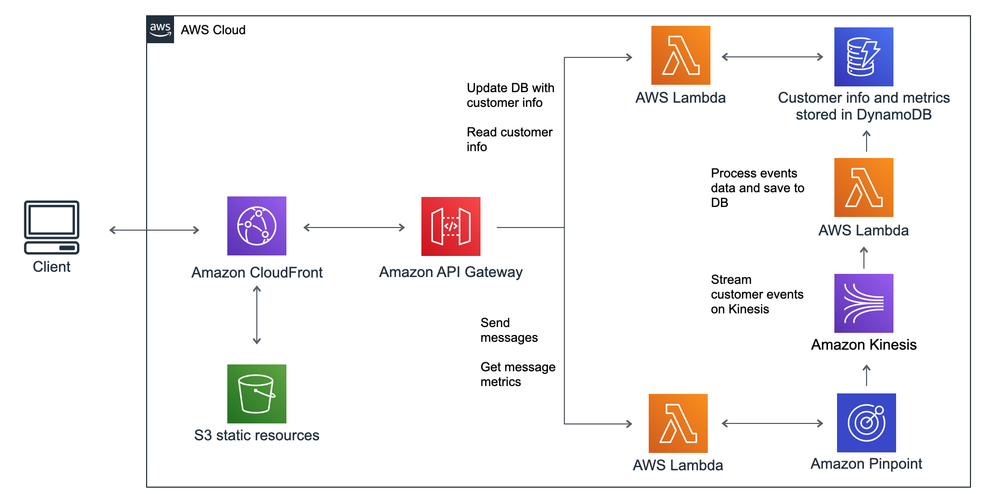

# Project Overview  
Link to website: http://chronicle-webapp.s3-website-us-east-1.amazonaws.com

## Requirements  
A/B Testing Platform  
 
Send two messages to two groups of customers. See how many customers open each message.  

#### Features:  
- Choose two groups based of customer metadata  
- Send message (email, sms, app notification) to each group  
- Collect metrics from each group  
- (Potential feature) Add new customers with metadata  

## Design  
#### Front-end  
- Allow users to perform each action described in features section
- Vue single page app hosted on S3

#### Back-end 
- Lambda + API Gateway to handle user input and make appropriate API calls to AWS Pinpoint
- User data (user id, campaign ids) stored in DynamoDB
- Customer data (customer id, metadata) stored in DynamoDB and used to update segments on AWS Pinpoint when user submits new campaign with selected cohort

#### Design diagram  
